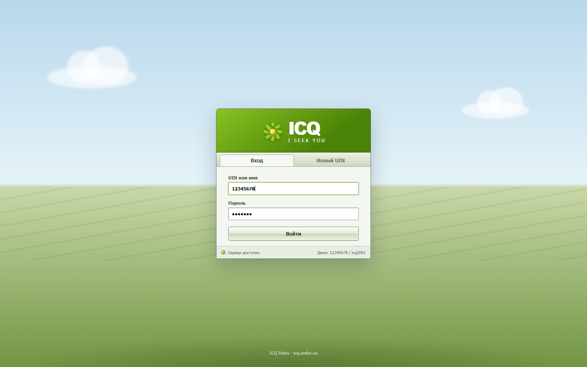

# ICQ Retro

Рабочий веб-мессенджер в стилистике классического ICQ для домена `icq.xedoc.ru`.



## Что уже работает

- регистрация с выдачей восьмизначного UIN;
- вход по UIN или имени;
- поиск и добавление контактов;
- Online, Away, DND и Invisible;
- сообщения в реальном времени через Socket.IO;
- постоянная история и счётчики непрочитанных;
- индикаторы «печатает» и прочтения;
- звуковые сигналы и классическая «встряска»;
- адаптивная мобильная версия.

При первом старте создаются два демо-аккаунта:

| UIN | Пароль |
| --- | --- |
| `12345678` | `icq2001` |
| `87654321` | `icq2001` |

## Локальная разработка

```bash
npm install
npm run dev
```

Интерфейс откроется на `http://localhost:5173`, API — на порту `3000`.

Продакшен-режим:

```bash
npm run build
JWT_SECRET="длинная-случайная-строка" npm start
```

## Развёртывание на icq.xedoc.ru

1. Создать DNS-запись `A` для `icq.xedoc.ru`, указывающую на IP сервера.
2. Скопировать проект на сервер и создать `.env`:

   ```env
   JWT_SECRET=заменить-на-случайную-строку-не-короче-32-символов
   ```

3. Запустить контейнер:

   ```bash
   docker compose up -d --build
   ```

4. Для первичного выпуска сертификата установить `deploy/icq.xedoc.ru.bootstrap.nginx.conf`, получить сертификат Let's Encrypt через webroot `/var/www/certbot`, затем заменить конфигурацию на `deploy/icq.xedoc.ru.nginx.conf`.
5. Проверить и перезагрузить nginx: `nginx -t && systemctl reload nginx`.

Данные пользователей и сообщений сохраняются в Docker volume `icq-data`. Для резервной копии достаточно архивировать этот volume.

## Переменные окружения

- `PORT` — порт приложения, по умолчанию `3000`;
- `JWT_SECRET` — ключ подписи сессий, в продакшене обязателен уникальный секрет;
- `APP_ORIGIN` — разрешённый origin для Socket.IO, в compose уже указан `https://icq.xedoc.ru`.

В Docker Compose приложение публикуется только на loopback-адресе сервера `127.0.0.1:3034`; внешний трафик принимает nginx.
